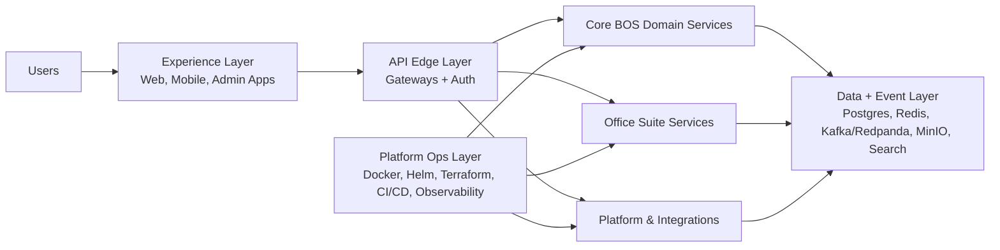

# Architecture Map: Implemented vs Planned
> Generated: 2026-02-22
> Scope: `/Users/AbiolaOgunsakin1/BOS/BAC-BOS-AI`

## 1. Normalized Architecture (Canonical Layers)

## 2. Implemented vs Planned Matrix

| Layer | Implemented (source present) | Partial / Scaffold | Planned / Declared-only |
|---|---|---|---|
| Experience Layer | `nexus-office-suite/frontend/{writer,sheets,slides,drive,mail,calendar,chat,meet,hub}-app`, `web`, `bac-platform/frontend` | `android`, `ios`, `flutter` are scaffold-level client starters | `web-console` referenced in root compose but source directory absent |
| API Edge + Identity | `nexus-engine`, `nexus-office-suite/backend/api-gateway`, `nexus-office-suite/backend/auth-service`, `services/idaas` | `apps/mail/backend` is standalone and overlapping with office-suite mail domain | Dedicated `gateway/` path described in README does not exist |
| Core BOS Domain | `services/crm`, `services/finance`, `services/ai`, `services/time-attendance` | `services/documents`, `services/hr`, `services/inventory`, `services/projects`, `services/marketing`, `services/support`, `services/vas` are mostly scaffold/simple handlers | Multiple domains described in docs (workplace/ecommerce/analytics/lowcode/flows/comms) are not present as complete root services |
| Office Suite Domain | `backend/{writer,sheets,slides,mail,calendar,drive,chat,meet,notification,collaboration}` + corresponding frontends | Some capabilities are implemented incrementally per service (feature depth varies by domain) | `forms-service`, `tasks-service`, `notes-service` declared in compose but missing source directories |
| Platform + Integrations | `bac-platform/services/{control-plane,crm,erp,ecommerce,mcp-orchestrator}`, `bac-platform/services/integrations/{google-workspace,odoo,zoho}` | `bac-platform/services/{crm,erp,ecommerce}` expose many placeholder handlers | Several complete-compose platform services have no source directories (dbaas, ipaas, bpa, designer, etc.) |
| Data + Event | Compose-backed infra definitions for Postgres, Redis, Kafka/Redpanda, MinIO, Elasticsearch, MongoDB | Root and office-suite stacks define different data/event topologies | Multi-region production targets (Yugabyte/ClickHouse/Qdrant/etc.) are largely documented rather than fully wired in this repo |
| Ops + Delivery | Root and office-suite workflow sets exist; Helm + Terraform assets exist | Significant workflow path mismatches in office-suite CI/test pipelines | Full production flow implied by docs is not fully reproducible from current repo state |

## 3. Canonical Component Grouping

### A. Core BOS (top-level `services/` + `nexus-engine/`)

- Implemented:
  - `/Users/AbiolaOgunsakin1/BOS/BAC-BOS-AI/nexus-engine/main.go`
  - `/Users/AbiolaOgunsakin1/BOS/BAC-BOS-AI/services/crm/main.go`
  - `/Users/AbiolaOgunsakin1/BOS/BAC-BOS-AI/services/finance/cmd/main.go`
  - `/Users/AbiolaOgunsakin1/BOS/BAC-BOS-AI/services/ai/main.py`
  - `/Users/AbiolaOgunsakin1/BOS/BAC-BOS-AI/services/idaas/src/index.ts`
  - `/Users/AbiolaOgunsakin1/BOS/BAC-BOS-AI/services/time-attendance/src/index.ts`
- Partial/scaffold:
  - `/Users/AbiolaOgunsakin1/BOS/BAC-BOS-AI/services/{documents,hr,inventory,projects,marketing,support,vas}`

### B. Office Suite (`nexus-office-suite/`)

- Implemented backend services:
  - `/Users/AbiolaOgunsakin1/BOS/BAC-BOS-AI/nexus-office-suite/backend/api-gateway`
  - `/Users/AbiolaOgunsakin1/BOS/BAC-BOS-AI/nexus-office-suite/backend/auth-service`
  - `/Users/AbiolaOgunsakin1/BOS/BAC-BOS-AI/nexus-office-suite/backend/writer-service`
  - `/Users/AbiolaOgunsakin1/BOS/BAC-BOS-AI/nexus-office-suite/backend/sheets-service`
  - `/Users/AbiolaOgunsakin1/BOS/BAC-BOS-AI/nexus-office-suite/backend/slides-service`
  - `/Users/AbiolaOgunsakin1/BOS/BAC-BOS-AI/nexus-office-suite/backend/mail-service`
  - `/Users/AbiolaOgunsakin1/BOS/BAC-BOS-AI/nexus-office-suite/backend/calendar-service`
  - `/Users/AbiolaOgunsakin1/BOS/BAC-BOS-AI/nexus-office-suite/backend/drive-service`
  - `/Users/AbiolaOgunsakin1/BOS/BAC-BOS-AI/nexus-office-suite/backend/chat-service`
  - `/Users/AbiolaOgunsakin1/BOS/BAC-BOS-AI/nexus-office-suite/backend/meet-service`
  - `/Users/AbiolaOgunsakin1/BOS/BAC-BOS-AI/nexus-office-suite/backend/notification-service`
  - `/Users/AbiolaOgunsakin1/BOS/BAC-BOS-AI/nexus-office-suite/backend/collaboration-service`
- Declared-only in compose:
  - `/Users/AbiolaOgunsakin1/BOS/BAC-BOS-AI/nexus-office-suite/backend/forms-service`
  - `/Users/AbiolaOgunsakin1/BOS/BAC-BOS-AI/nexus-office-suite/backend/tasks-service`
  - `/Users/AbiolaOgunsakin1/BOS/BAC-BOS-AI/nexus-office-suite/backend/notes-service`

### C. BAC Platform (`bac-platform/`)

- Implemented:
  - `/Users/AbiolaOgunsakin1/BOS/BAC-BOS-AI/bac-platform/services/control-plane/main.go`
  - `/Users/AbiolaOgunsakin1/BOS/BAC-BOS-AI/bac-platform/services/mcp-orchestrator/main.py`
  - `/Users/AbiolaOgunsakin1/BOS/BAC-BOS-AI/bac-platform/services/integrations/{google-workspace,odoo,zoho}/src/main.go`
- Partial/scaffold:
  - `/Users/AbiolaOgunsakin1/BOS/BAC-BOS-AI/bac-platform/services/crm/main.go`
  - `/Users/AbiolaOgunsakin1/BOS/BAC-BOS-AI/bac-platform/services/erp/main.go`
  - `/Users/AbiolaOgunsakin1/BOS/BAC-BOS-AI/bac-platform/services/ecommerce/main.go`

## 4. Normalization Rules Recommended

1. Canonical service naming:
   - Backends: `backend/<domain>-service`
   - Frontends: `frontend/<domain>-app`
   - Root core services: `services/<domain>`
2. Compose scope separation:
   - Keep `docker-compose.yml` limited to implemented core services.
   - Keep `nexus-office-suite/docker-compose.yml` limited to implemented office services.
   - Keep `docker-compose.complete.yml` either fully implemented or clearly marked as blueprint only.
3. CI path normalization:
   - Replace `services/<name>` references in office-suite workflows with `backend/*-service` and `frontend/*-app`.
4. Documentation synchronization:
   - Distinguish implemented, partial, and planned components consistently in root README/docs.

## 5. Practical Architecture Baseline (What to Treat as Real Today)

- Real baseline systems:
  - Core activation + core services: `nexus-engine`, CRM, Finance, AI, IDaaS, Time/Attendance.
  - Office suite: API/Auth + Writer/Sheets/Slides/Drive/Mail/Calendar/Chat/Meet + Notification/Collaboration.
  - Platform integrations: Google Workspace, Odoo, Zoho connectors.
- Everything else should be treated as either:
  - Incremental scaffold to complete, or
  - Blueprint-level declaration pending source implementation.
